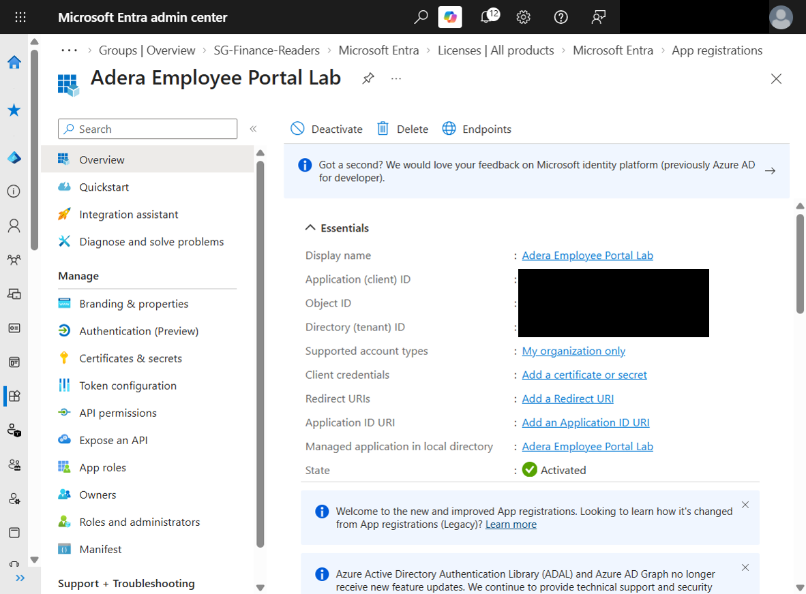
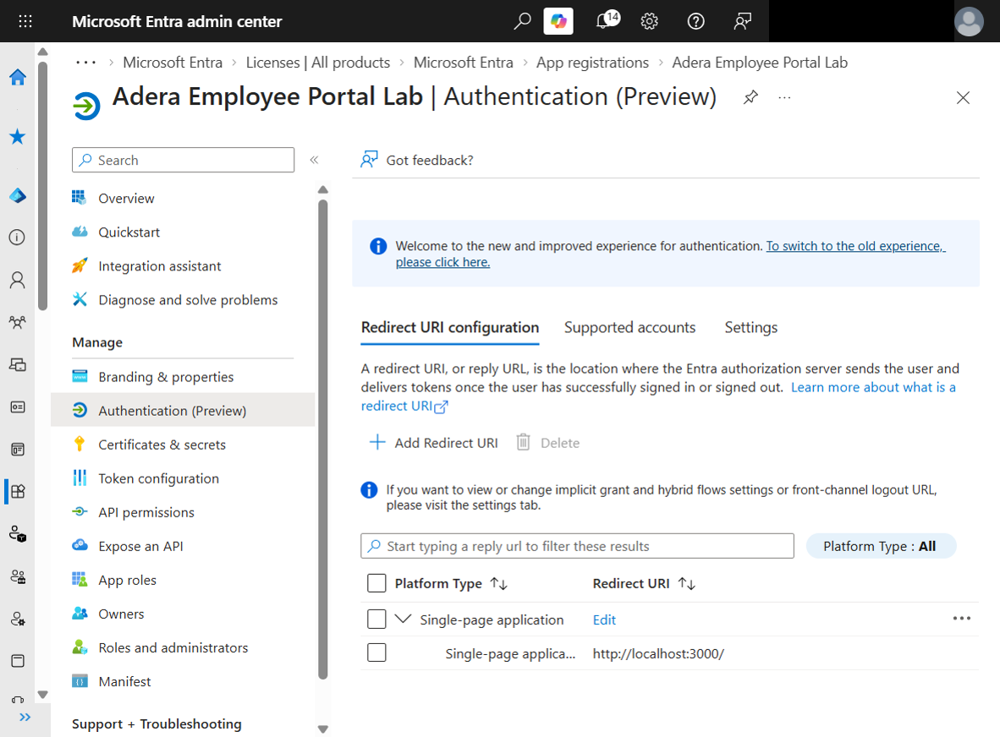
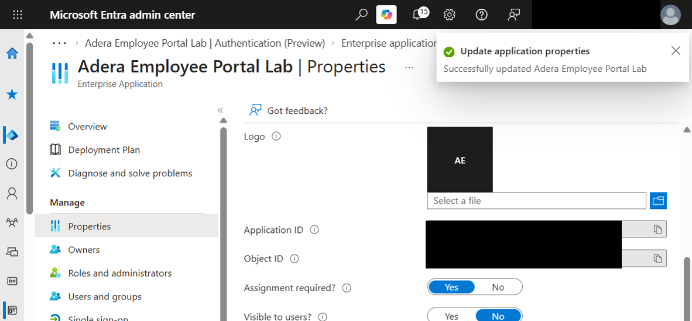
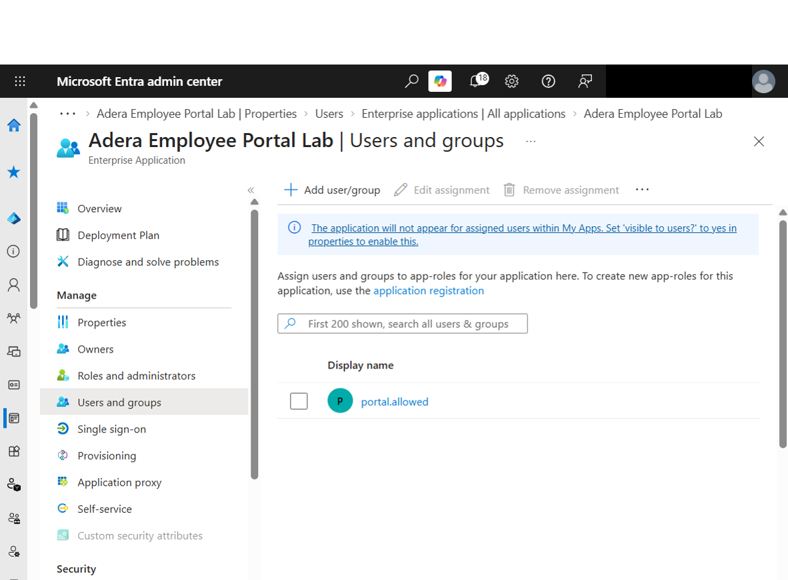
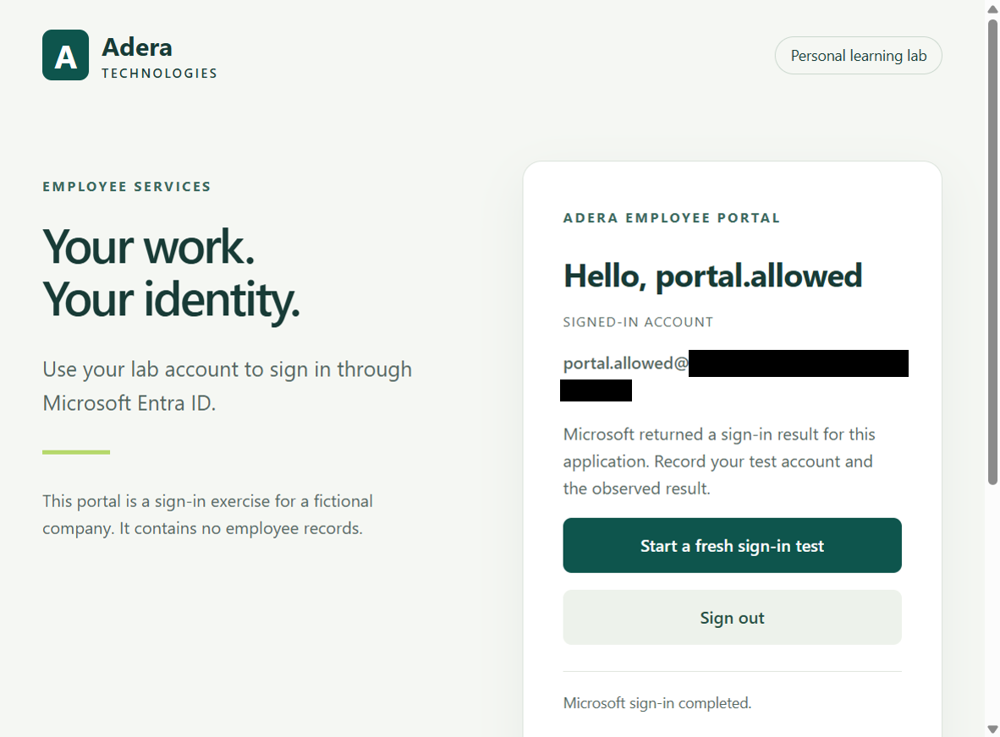
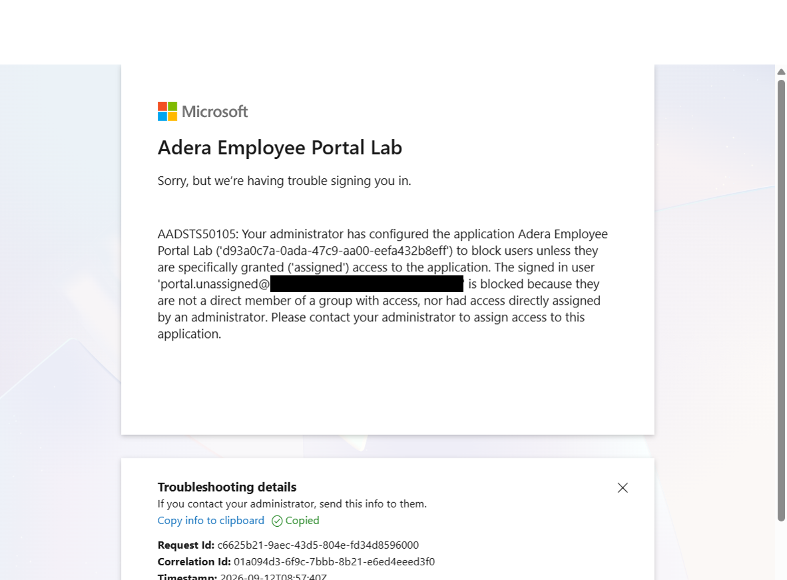
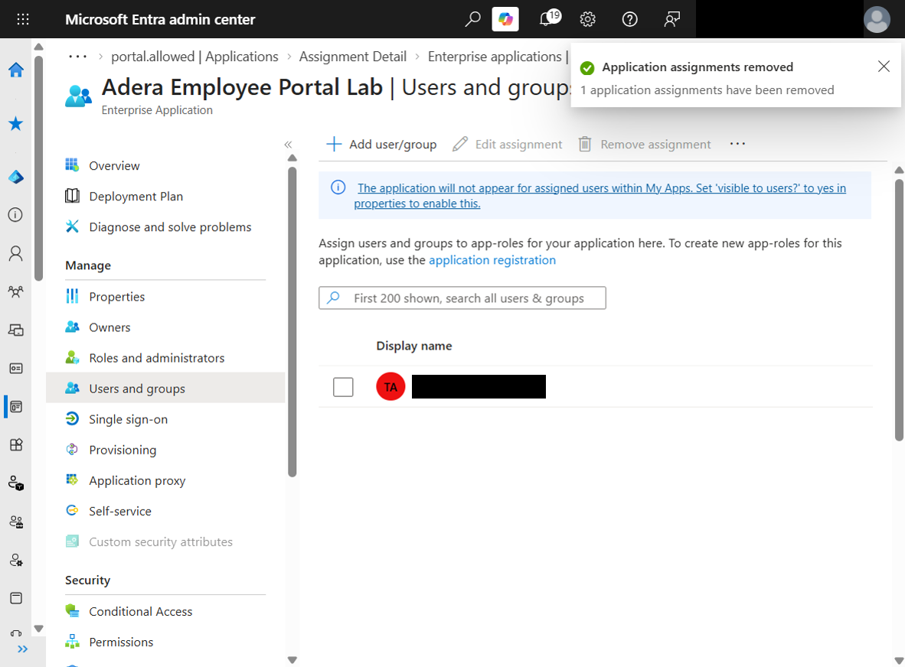
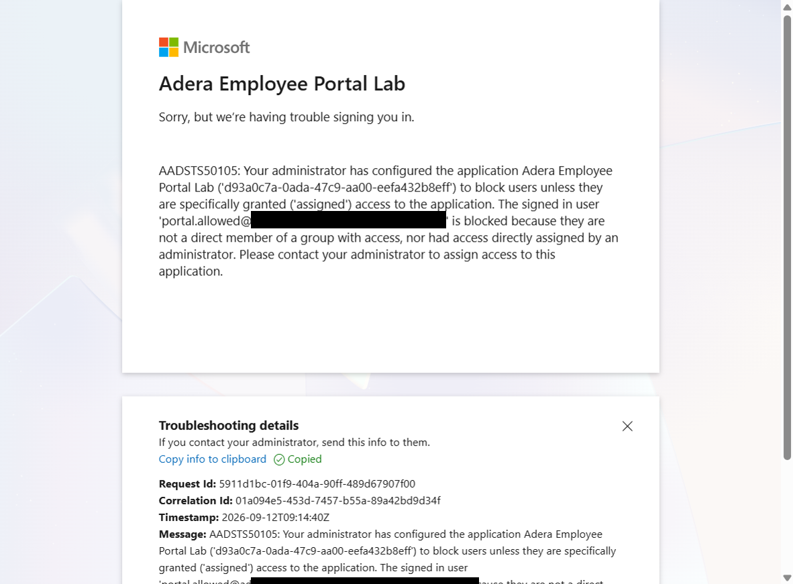

# Employee Portal Access Control with Microsoft Entra ID

A personal IAM lab for the fictional company Adera Technologies, testing application assignments and employee portal sign-in.

## Status

Application configuration and all three sign-in tests completed. All eight redacted screenshots are included below.

## Objective

Configure Microsoft Entra sign-in for a local test portal and verify that application assignment controls whether ordinary test users can complete a fresh sign-in.

## Tools and scope

- Microsoft Entra ID Free
- A local employee portal at http://localhost:3000/
- Individual user assignments
- GitHub for technical documentation
- Medium for a planned project walkthrough

## Activity 1 — Register the application

Registered **Adera Employee Portal Lab** as a single-tenant application. On the Overview page, confirmed the application name and supported account type: **My organization only**.

**What I learned:** App registration establishes the application's identity in Entra. It does not create or host the portal.



*Registration overview captured before the redirect URI was added.*

## Activity 2 — Configure the redirect URI

Added a **Single-page application** platform with the redirect URI:

```
http://localhost:3000/
```

Refreshed the Authentication page and confirmed the URI remained listed. The local portal was subsequently used for the sign-in tests below.

**What I learned:** The redirect URI is where Entra returns the browser after authentication.



## Activity 3 — Require application assignment

Set **Assignment required?** to **Yes** for Adera Employee Portal Lab. Refreshed Properties and confirmed the setting remained Yes.

**Purpose:** Require an application assignment for the ordinary users tested in this lab to complete sign-in.



## Activity 4 — Assign the test user

- Created the ordinary test accounts **portal.allowed** and **portal.unassigned**.
- Assigned only **portal.allowed** to Adera Employee Portal Lab.
- Checked the application's Users and groups list: portal.allowed was listed and portal.unassigned was absent.

This was the configuration before testing. The assignment for portal.allowed was later removed for Test 3.



## Testing status

| Test | Expected result | Observed result | Status |
| --- | --- | --- | --- |
| Assigned user | Successful sign-in | Returned to the portal as portal.allowed | Pass |
| Unassigned user | Sign-in denied | AADSTS50105: application assignment missing | Pass |
| Previously assigned user after removal | Fresh sign-in denied | AADSTS50105: application assignment missing | Pass |

## Test 1 — Assigned user

- **User:** portal.allowed
- **Application assignment:** Present
- **Expected:** Successful sign-in
- **Observed:** Returned to the portal as portal.allowed
- **Result:** Pass



## Test 2 — Unassigned user

- **User:** portal.unassigned
- **Application assignment:** Absent
- **Expected:** Sign-in denied because assignment is required
- **Observed:** Entra returned AADSTS50105, explicitly stating that the user lacked an application assignment
- **Result:** Pass
- **Test time:** 2026-09-12 08:57:40 UTC



## Test 3 — Sign-in after assignment removal

- **User:** portal.allowed
- **Account:** Remained enabled
- **Change:** Removed the application assignment and verified its absence
- **Expected:** New sign-in denied
- **Observed:** Entra returned AADSTS50105, explicitly stating that the user lacked an application assignment
- **Result:** Pass
- **Test time:** 2026-09-12 09:14:40 UTC



*The remaining entry is the administrator account, with its name redacted. The test account portal.allowed is absent.*



## What I learned

An enabled user account does not automatically have permission to sign in to every application. In these tests, requiring assignment allowed the assigned user to sign in and blocked users without an assignment. Removing the assignment also blocked a fresh sign-in by the previously assigned user.

## Evidence handling

Eight screenshots document the configuration and observed results. Personal account details and tenant domains have been covered with opaque blocks. Screenshot 03 was cropped to remove an overlapping capture; the saved assignment setting remains visible.

## Testing limitations

- These results cover fresh sign-in attempts by ordinary test accounts.
- Test 3 does not demonstrate that an existing session ended.
- The local portal is a sign-in demonstration. These tests do not establish protection of private backend data or APIs.
- Application assignment is distinct from permissions to read or edit documents.
